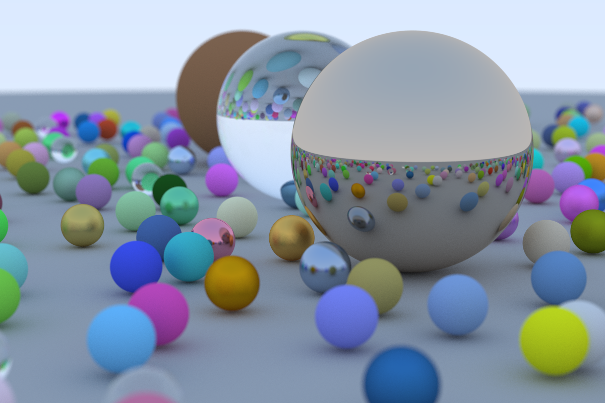

# Rusty-Ray-Tracer
Learning rust while following [_Ray Tracing in One Weekend_](https://raytracing.github.io/books/RayTracingInOneWeekend.html)

Plus:
- multi-threaded render (chunked)
- outputs bitmap image format

